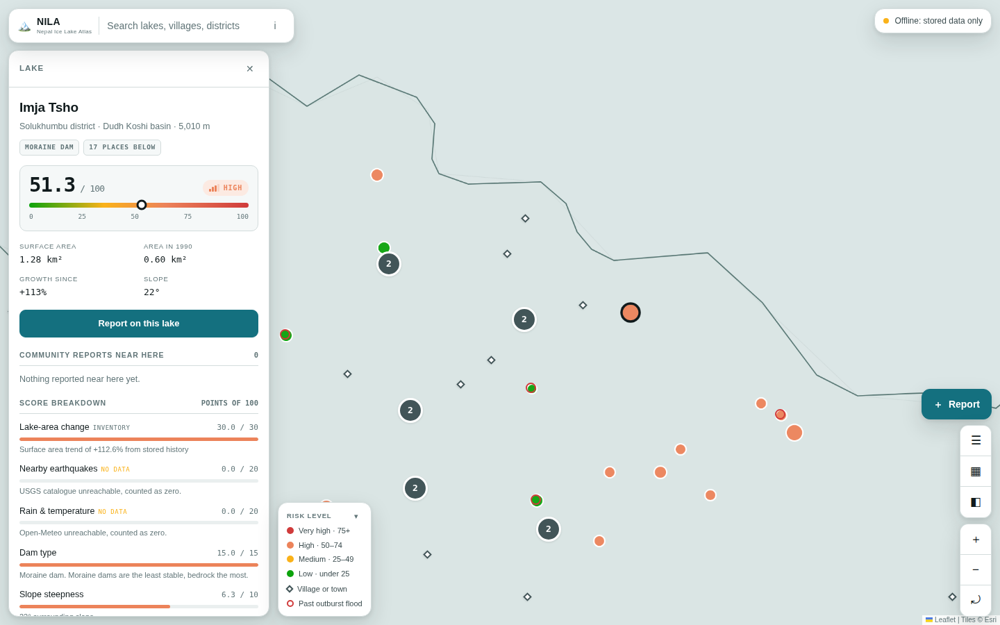

# NILA: Nepal Ice Lake Atlas

*Nila* (नीला) means blue, for the meltwater these lakes hold.

A map of glacial lake outburst flood (GLOF) risk in Nepal. 24 glacial lakes,
57 downstream villages and towns, 7 recorded outburst floods, and a community
reporting system, scored by a six-factor risk model that recalculates live in
the browser from USGS earthquake data and Open-Meteo weather.



> **This is a demonstration prototype, not a flood warning system.** Lake
> attributes are compiled from published literature and are approximate, and
> the scoring weights have not been validated by a glaciologist. For real
> warnings, follow Nepal's Department of Hydrology and Meteorology.

---

## What it does

- **A map you can actually use.** Leaflet, three basemaps, marker clustering,
  search across lakes, villages and districts. Click anything to open its
  panel: a lake, a village, a past flood.
- **A 0 to 100 risk score per lake** from six weighted inputs, with the
  breakdown shown factor by factor and every factor labelled with where its
  data came from.
- **Live recalculation.** The browser fetches USGS earthquakes and Open-Meteo
  weather on load and rescores every lake using the same formulas as the
  Python engine, falling back to a stored snapshot when it cannot reach them.
- **Community reports**, scoped three ways: an exact spot on the map, a named
  lake or village, or a whole district. Reports are shared between visitors
  through a Cloudflare D1 database, and they feed the score.
- **Elevation profiles** per lake, plotted from stored elevations against
  straight-line distance to the settlements below it.

## Stack

Leaflet and vanilla JavaScript on the front, inlined at build time so the page
has no third-party runtime dependency. Cloudflare Pages for hosting, a Pages
Function for the reports API, and Cloudflare D1 (SQLite at the edge) for
storage. A second, fuller implementation lives in `backend/`: Flask,
PostgreSQL with PostGIS, and an APScheduler job that rescores on an interval.

The scoring model is implemented twice, in Python and in JavaScript, and the
two produce identical numbers from identical inputs.

Full detail in [ARCHITECTURE.md](ARCHITECTURE.md), including the parts that
were genuinely hard: overlapping click targets, boundary clipping with
Sutherland-Hodgman and Douglas-Peucker, and a colour palette that failed an
accessibility check and had to be redone.

## The scoring model

| Factor | Weight | Normalisation |
|---|---:|---|
| Lake-area change | 30 | `pct / 15`, saturating at 15% growth |
| Nearby earthquakes | 20 | `max(count/5, (maxMag-4)/2.5)` |
| Rain and temperature | 20 | `0.6*(precipAnom/60) + 0.4*(tempAnom/3)` |
| Dam type | 15 | moraine 1.0, ice 0.75, bedrock 0.15 |
| Slope steepness | 10 | `deg / 35` |
| Community reports | 5 | severity-weighted |

Each factor is clamped to 0..1, multiplied by its weight, summed. Under 25 is
low, 25 to 49 medium, 50 to 74 high, 75 and up very high.

## What is real and what is not

This matters for a hazard tool, so the app surfaces it per factor and this
README repeats it.

- **Lake inventory**: `data/sample_lakes.csv` is a hand-compiled set of 24
  well-documented Nepal glacial lakes with approximate coordinates, areas and
  dam types, in the shape ICIMOD's inventory would take. It is **not** the
  official ICIMOD dataset, which is distributed through a data request rather
  than an open download. Replacing it with the real inventory is the single
  biggest upgrade available.
- **USGS earthquakes and Open-Meteo**: real, free, keyless APIs, called live
  from the browser. Both fail closed: on a network error the factor is scored
  zero and labelled "no data" rather than guessed.
- **Sentinel-2 lake-area change**: wired up against the Copernicus Data Space
  Ecosystem with an OAuth2 client-credentials flow and an NDWI evalscript, but
  it needs credentials you create. Without them it falls back to the stored
  area history, which is real data but not recent imagery, and is labelled
  "inventory" wherever it appears.
- **Community reports** are unverified observations from strangers and are
  labelled that way everywhere they appear.

## Running it

```
python build_page.py                       # rebuild the page from template + data
cd web && npx wrangler pages dev public     # real API against a local database
```

`build_page.py` rebuilds `web/public/index.html` from `page_template.html` and
the data files, so never edit `index.html` directly.

Deployment walkthrough in [DEPLOY.md](DEPLOY.md).

## Known gaps

- The weights are a reasonable starting point, not a validated model. Before
  this informs any real decision it needs a glaciologist's review against
  known case studies such as the 1985 Dig Tsho and 2017 Langmale events.
- No automated test suite. The pure scoring functions in
  `backend/app/services/risk_engine.py` are the highest-value first targets.
- No accounts or moderation UI. Reports are anonymous with IP-hash rate
  limiting and spam heuristics; removing a bad report means a database query.

## Licence

MIT. See [LICENSE](LICENSE).
